# PowerStore-Metrics-Exporter for Prometheus

## Test environment introduction

### Testing OS

| System Version               | CPU | Memory | Disk | Framework | IP            |
|------------------------------|-----|--------|------|-----------|---------------|
| Red Hat Enterprise Linux 8.9 | 8   | 16G    | 500G | X86_64    | 192.168.9.151 |


*PS: PowerStore-Metrics-Exporter, Prometheus, Grafana will install in this OS.*

### Software Version and IP

| Software Name               | Deployment mode           | Version | Machine IP and Port | Profile location                           |
|-----------------------------|---------------------------|---------|---------------------|--------------------------------------------|
| powerstore-metrics-exporter | Binary file run           | 1.0     | 192.168.9.151:9010  | /usr/local/bin/powerstore-metrics-exporter |
| Prometheus                  | Standalone Linux Binaries | 2.52.0  | 192.168.9.151:9090  | /usr/share/grafana                         |
| Grafana                     | Standalone Linux Binaries | 9.5.2   | 192.168.9.151:3000  |                                            |

*PS: Needs to download exporter binary file or pull golang source code and compile it firstly.*

### Monitoring Software Installation Guide

- **Prometheus**: [Installation Guide](https://prometheus.io/docs/introduction/first_steps/)
- **Grafana**: [Download](https://grafana.com/grafana/download?pg=get&plcmt=selfmanaged-box1-cta1)
- **powerstore-metrics-exporter**: [GitHub Repository](https://github.com/dell/powerstore-metrics-exporter)

### PowerStore

| Product    | Version | Management IP |
|------------|---------|---------------|
| PowerStore | 3.6.0.0 | 127.16.254.31 |

## Exporter deployment and testing

### Binary Compiling
Source code location：[powerstore-metrics-exporter Guide](https://github.com/dell/powerstore-metrics-exporter)
Pull the source code from GitHub and compile it into a binary executable via golang


```shell
# Create a new folder
mkdir ./powerstore-metrics-exporter

# Enter the folder
cd powerstore-metrics-exporter

# Pull the code
git clone https://github.com/dell/powerstore-metrics-exporter.git

# Compile binary
go build -o powerstore-metrics-exporter
```


### Exporter Deployment

After compiling or downloading the binaries for `powerstore-metrics-exporter`, copy the file to the `/etc/local/bin/powerstore-metrics-exporter` directory on the host and assign execute permissions to the file.

```shell
# Grant executable permissions to powerstore-metrics-exporter
chmod +x /usr/local/bin/powerstore-metrics-exporter/powerstore-metrics-exporter
```
**Example**：

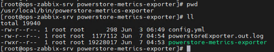

### Modify the Configuration File

Exporter config file location: [Config File on powermstore](https://github.com/perseushub/powerstore-metrics-exporter/blob/main/config.yml)[or at relate github pull source code file folder location ]

Copy the `config.yml` file and place it in the `/etc/local/bin/powerstore-metrics-exporter` directory. Configuration parameters are as follows:

#### Configuration Items

| Configuration Item       | Description                   | Default Option                        |
|--------------------------|-------------------------------|---------------------------------------|
| `exporter.port`          | PowerStore Exporter Port      | 9010                                  |
| `log.type`               | Log format (standard or json) | logfmt                                |
| `log.path`               | Log storage path              | ./powerstore_metrics_Exporter.out.log |
| `log.level`              | Minimum log output level      | Info                                  |
| `storageList.ip`         | PowerStore Manager IP         | 127.16.254.31                         |
| `storageList.user`       | PowerStore Username           | monitor                               |
| `storageList.password`   | PowerStore Password           |                                       |
| `storageList.apiVersion` | PowerStore API Version        | v1                                    |


**Example**：

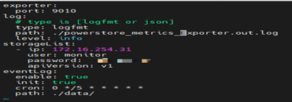

### Start and Test the Acquisition Data

Start the exporter:
```shell
# Start powerstore-metrics-exporter with configuration file
sudo ./powerstore-metrics-exporter -c ./config.yml
```

Test metrics data with `curl`:

```shell
# Request metrics data
curl http://{your_powerstore_exporter_ip}:{port}/metrics/{your_powerstore_manager_ip}/volume

# Example for local IP
curl http://127.0.0.1:9010/metrics/127.16.254.31/volume

# Or using the machine IP
curl http://192.168.9.151:9010/metrics/127.16.254.31/volume
```
If you request exporter target url and response the correct result, means the powerstore-metrics-exporter is working.

**Example**：

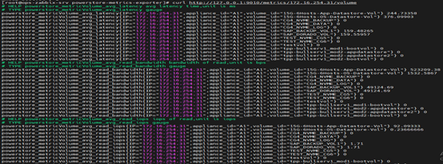

### Prometheus Setting

Prometheus config file location：[Prometheus Config](https://github.com/dell/powerstore-metrics-exporter/blob/main/templates/prometheus/prometheus.yml) `or at relate github pull source code file folder location `
Please merge and update /usr/local/bin/prometheus/prometheus.yml file, add powerstore metrics exporter target in your Prometheus.

The following table explains the configuration items in the Prometheus configuration file.

#### Configuration Items

| Configuration Item | Description                        | Default Option                             |
|--------------------|------------------------------------|--------------------------------------------|
| `Job_name`         | Name of the scrape job             | Powerstore_172.16.254.31_port              |
| `Honor_timestamps` | Use the scrape server time         | True                                       |
| `Scrape_interval`  | Interval between scrapes           | 15m                                        |
| `Scrape_timeout`   | Timeout for scraping               | 3m                                         |
| `Metrics_path`     | HTTP path for scraping metrics     | /metrics/{your_powerstore_manager_ip}/port |
| `scheme`           | Scheme for scraping                | http                                       |
| `Follow_redirects` | Follow redirects                   | True                                       |
| `Static_configs`   | List of target addresses and ports | {your_powerstore_exporter_ip}:{port}       |

*Backup your Prometheus config file before making changes.*


**Example**：

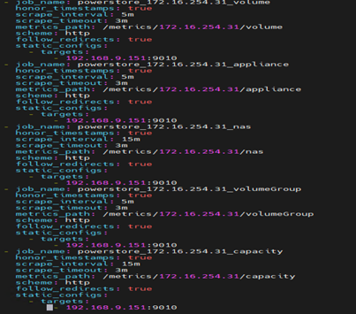

After targets are added, reload or restart Prometheus. If the targets are added successfully, you can view the related PowerStore metrics data in Prometheus which web url is :http://192.168.9.151:9090

**Example**：


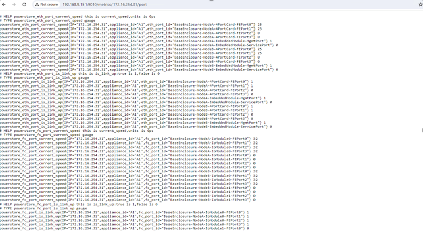

### Grafana Setting

1. Log in to Grafana and create a new Prometheus data source.
2. Import the dashboard template from the provided URL.

#### Add the Data Source

- Steps: Connection -> Data Sources -> Add new data source -> Prometheus.
- Enter the URL of the Prometheus installation, e.g., `http://192.168.9.151:9090`.
- Slide down to select Save & test.

Note: If the Data is working with Prometheus in the Data Sources, the data source has been added successfully
**Example**：

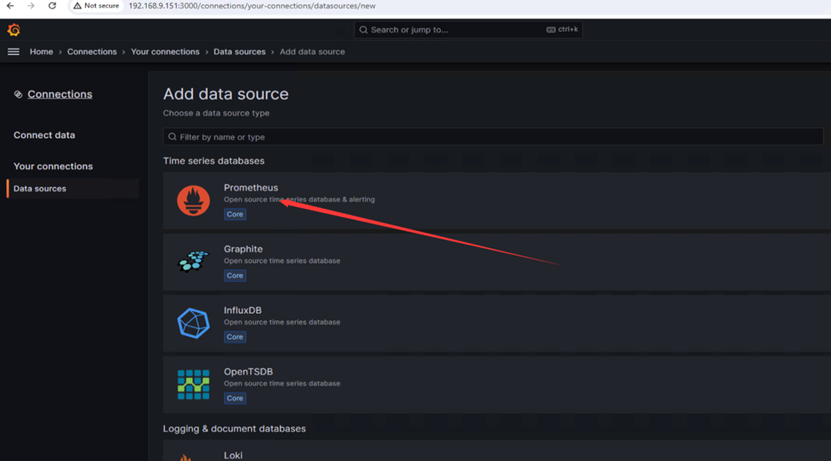

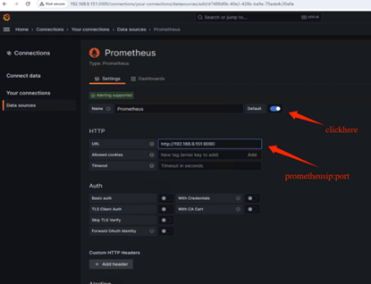

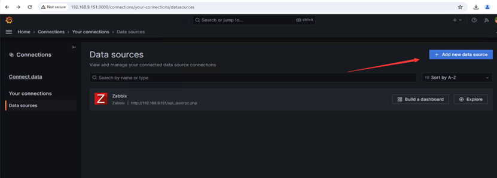


#### Import the Template

Grafana dashboard file location: [Grafana Dashboard Template](https://github.com/dell/powerstore-metrics-exporter/blob/main/templates/prometheus/grafana/powerstore%20exporter%20from%20prometheus%20dashboard.json)

- Steps: Dashboards -> New -> Import -> Upload the JSON template file.

**Example**：

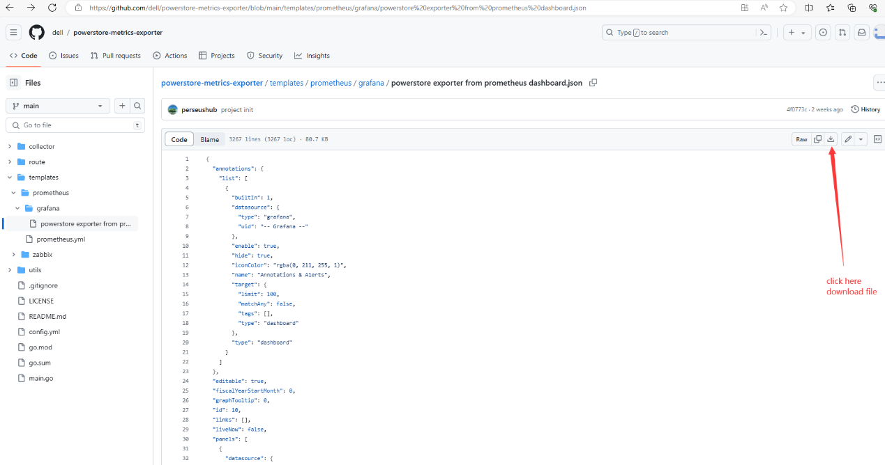

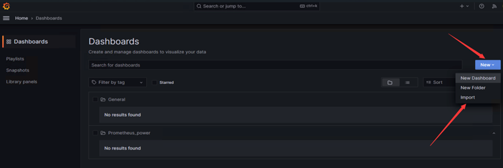

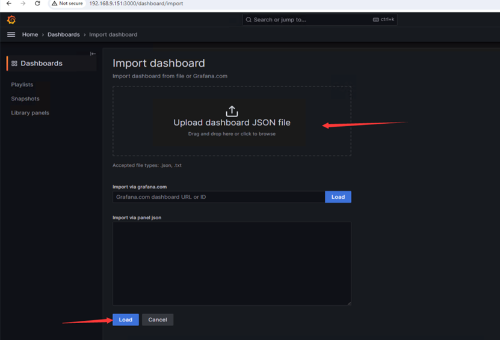

After importing, select the `powerstore-exporter-from-prometheus-dashboard` to view the data and charts.
**Example**：

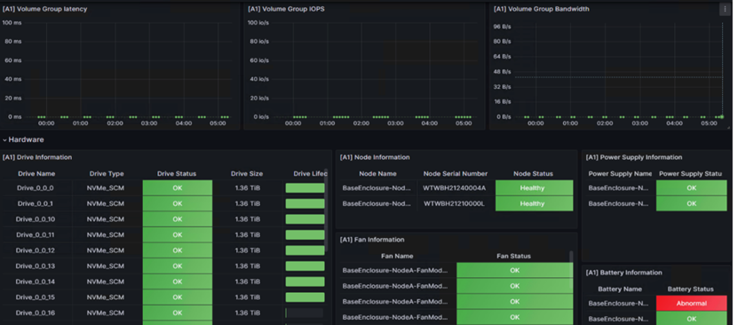

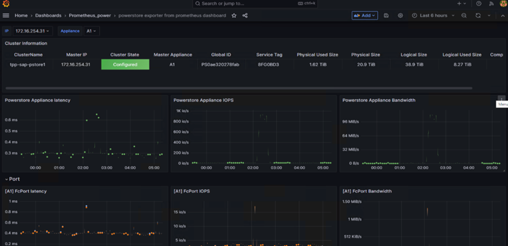
